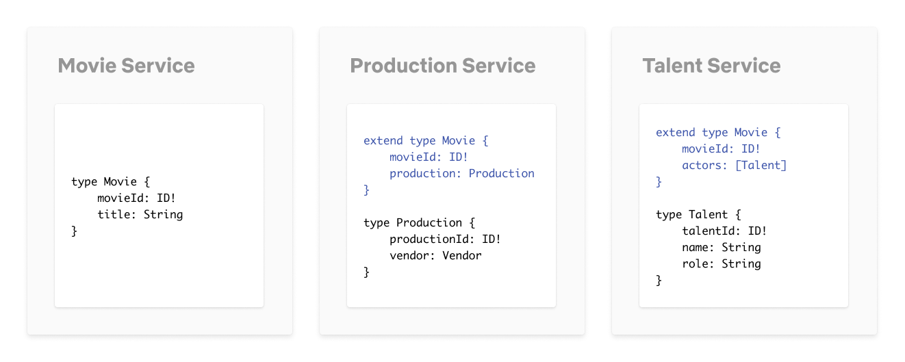
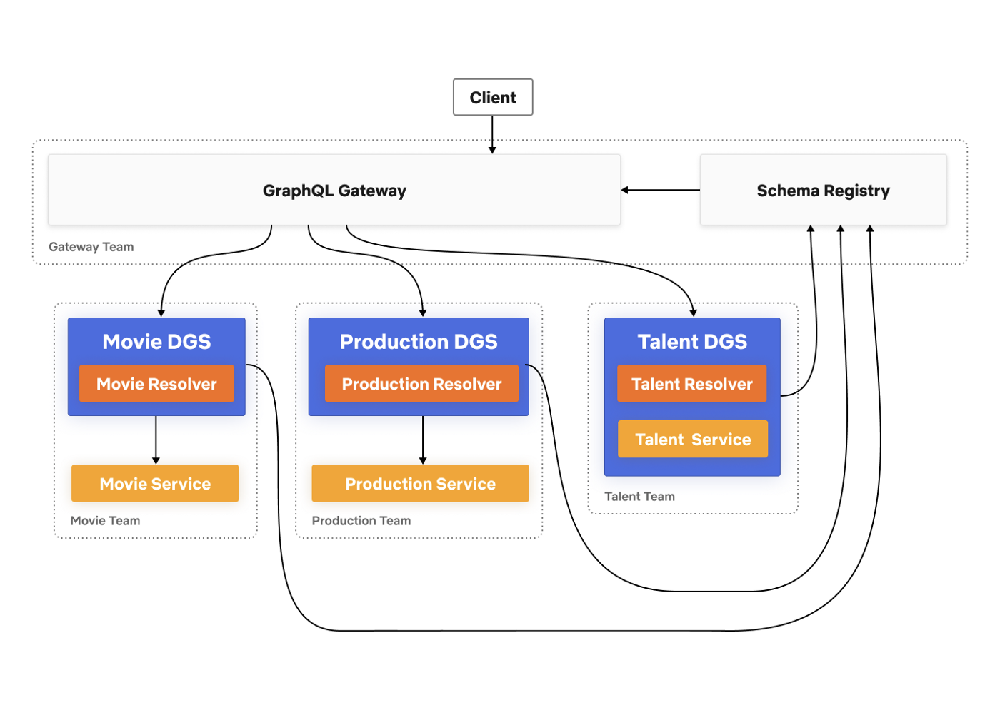
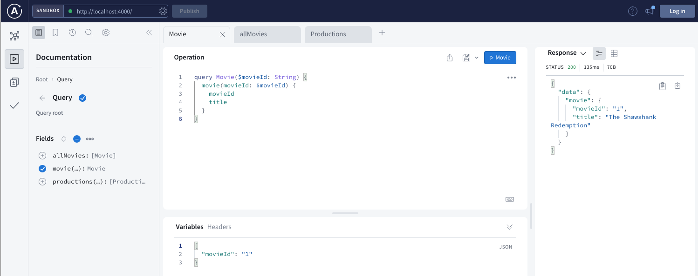
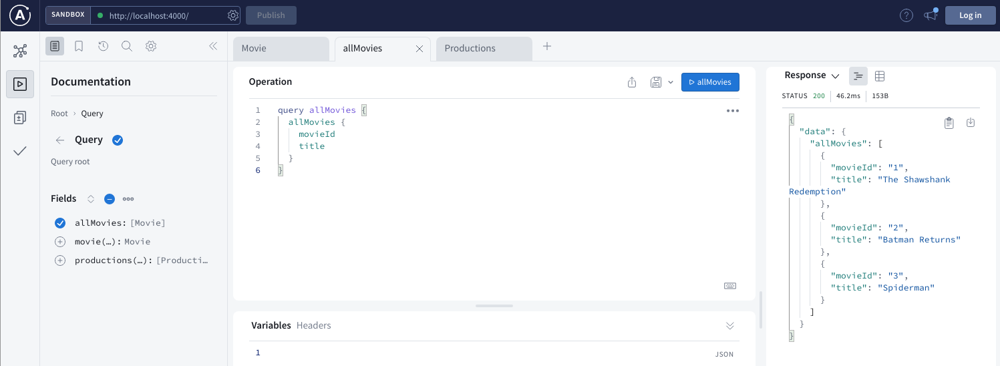
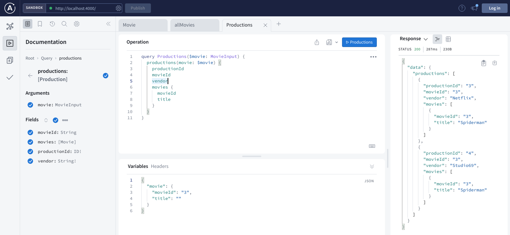

# graphql-federation

An Example based on Netflix's Studio Search using [Quarkus Graphql.](https://quarkus.io/guides/smallrye-graphql)
- https://netflixtechblog.com/how-netflix-scales-its-api-with-graphql-federation-part-1-ae3557c187e2
-  https://netflixtechblog.com/how-netflix-scales-its-api-with-graphql-federation-part-2-bbe71aaec44a


[A single](https://principledgraphql.com/integrity#1-one-graph), unified view of the graph, while keeping development efforts decoupled. 



Responsibility for defining and implementing the graph is divided across multiple stream aligned teams owning the services.

Each stream aligned team is responsible for maintaining the portion of the schema that exposes their data and services. They have the flexibility to develop independently and operate on their own release cycle.



## GraphQL Gateway

Uses the [Apollo Federation Gateway](https://www.apollographql.com/docs/federation/gateway/) in front of the distributed microservices.

Patch the gateway to accept Quarkus 'Content-Type: application/graphql+json'

```bash
--- /home/mike/git/graphql-federation/gateway/node_modules/@apollo/gateway/dist/datasources/RemoteGraphQLDataSource.js.orig	2022-04-23 09:29:32.487666110 +1000
+++ /home/mike/git/graphql-federation/gateway/node_modules/@apollo/gateway/dist/datasources/RemoteGraphQLDataSource.js	2022-04-23 09:29:54.131684859 +1000
@@ -138,7 +138,7 @@
}
parseBody(fetchResponse, _fetchRequest, _context) {
const contentType = fetchResponse.headers.get('Content-Type');
-        if (contentType && contentType.startsWith('application/json')) {
+        if (contentType && (contentType.startsWith('application/json') || contentType.startsWith("application/graphql+json"))) {
             return fetchResponse.json();
         }
         else {
```

Run the gateway in a terminal:

```bash
npm run start
```

Federated GraphQL playgound available when you see: `🚀 Gateway ready at http://localhost:4000/`

## GraphQL Microservices

For each service `Movie, Production, Talent` run in separate terminals:

```bash
mvn quarkus:dev
```

Build a Patched `smallrye-graphql` library - that is currently `1.4.4-SNAPSHOT` version:

```bash
git clone https://github.com/t1/smallrye-graphql.git smallrye-graphql-t1
cd smallrye-graphql-t1
git checkout remotes/origin/521-federation-into-core
mvn clean install
```

This is being merged into core, currently DRAFT - https://github.com/smallrye/smallrye-graphql/pull/1132

## Example GraphQL Queries

Movie



All Movies



Productions




